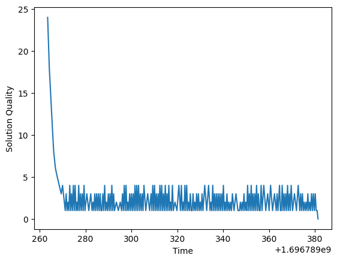

# N-Queens
Implementation of N Queen State Space Search Problem
Overview
This GitHub repository contains an implementation of the N-Queen state search problem, which involves placing N queens on an N×N chessboard such that no two queens threaten each other. The solution is found using a local search algorithm. This repository also demonstrates techniques for overcoming local minima, including random restart and shoulder traversal. The code is written in Python and uses the matplotlib library for visualization.

Problem Description
The N-Queen problem is a classic combinatorial problem where the goal is to find a configuration of N queens on an N×N chessboard, such that no two queens threaten each other. Queens can move horizontally, vertically, and diagonally.

Implementation
The implementation consists of the following components:

1. Configuration and Initialization
• The chessboard and state representations are initialized.  
• The configureRandomly function sets up an initial random configuration for the queens.  
• The printBoard and printState functions display the board and state, respectively.  
2. Objective Function
• The calculateObjective function calculates the number of attacking queens in the current state.  
3. State Generation
• The getNeighbour function generates neighboring states by moving a queen to a different row in its column.  
• The hillClimbing function uses a hill-climbing local search algorithm to improve the state by iteratively moving queens to reduce the number of attacking queens.  
4. Random Restart and Shoulder Traversal 
• If the algorithm gets stuck in a local minimum, it applies a random restart by randomly reconfiguring the board and state.  
• Shoulder traversal is implemented by randomly modifying the position of a queen when no improvement can be made.

6. Visualization
• The solution quality and execution time at each iteration are recorded for visualization.   
• A line plot is created using matplotlib to show how the solution quality evolves over time.    

Results  
The code will display a line plot showing how the solution quality changes over time as the local search algorithm progresses.   
